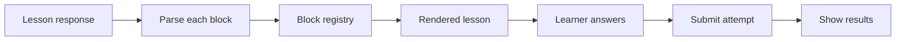

# AI tutor frontend onboarding

Status: draft. Everything here is a proposal unless it says decided.

**This is the frontend's view of a contract owned by the backend developer.** Where this
document and the schema disagree, the schema wins.

## What we are building

A personalized AI tutor. A learner picks one topic and the real-world reason they want
it. The app teaches it over many sessions with short interactive lessons, tracks what
the learner has actually learned, and builds a glossary and reference sheets from that.

The frontend has one job that matters most. It turns lesson JSON into a calm, readable
lesson with instant practice feedback. Everything else is supporting screens around
that.

## Where the idea comes from

Matt Pocock's `teach` skill for coding agents: https://github.com/mattpocock/skills/tree/main/skills/productivity/teach

The skill runs a tutoring workflow inside a folder of files. We turn that folder into a
multi-user app. Skim `SKILL.md` first, because it explains why lessons are short, why
practice gives instant feedback, and why the glossary and records exist.

## Read these first

- [`GLOSSARY.md`](../GLOSSARY.md) — every domain term, defined once
- [`docs/lesson-schema.json`](lesson-schema.json) — **the contract.** The lesson format
  and attempt contract, authoritative
- [`docs/lesson-format.md`](lesson-format.md) — prose explaining the format and why
- [`docs/spec.md`](spec.md) — the product spec and user stories
- [`docs/backend-onboarding.md`](backend-onboarding.md) — what the backend guarantees
  us
- [`docs/adr/`](adr/) — decisions that constrain the implementation

There is no lesson JSON in this document on purpose. It lived here once, drifted from
the backend's copy across five rounds of review, and now lives in one place. Read the
schema.

## Who owns what

- The backend owns the rules. It validates lessons, grades answers, writes records, and
  promotes glossary terms.
- The frontend owns presentation. It renders what the backend sends, collects answers,
  and shows feedback.
- **The frontend never calls the model.** All AI work goes through the API.
- Lesson JSON carries meaning only, with no colors, sizes, or spacing. Styling lives
  entirely in the frontend, so a redesign restyles every stored lesson.
- A contract change is a commit to `docs/lesson-schema.json` in this repository. If it
  is not in the schema, it has not happened.

## Stack

All decided, all installed:

- React 19 with TypeScript, built by Vite
- Mantine for UI components
- TanStack Query for server state
- Axios behind one shared client that attaches the bearer token
- React Hook Form and Zod for forms and for parsing API responses
- Vitest with Testing Library
- Zustand for the auth session

**No HTTP mocking library.** Tests call API functions against Vitest, with fixture
responses. Adding a mocking layer is a later decision, not a current one — see
[Working without the backend](#working-without-the-backend).

Authentication is **already built**: Sanctum personal access tokens, sign in at
`/login`, sign up at `/register`, session persisted in a Zustand store. It is decided
and not to be reopened. See `src/features/auth/`.

## Screens

Proposed routes. All live inside a workspace except the first two.

- Workspace list and workspace creation.
- Mission interview. A chat that runs when a workspace has no active mission. It ends
  with a mission card the learner confirms.
- Workspace home. Mission card, a button for the next lesson, due reviews, and recent
  progress.
- Lesson list and lesson reader. The reader is the core screen.
- Review queue for spaced practice.
- Resources, with a gaps section and a toggle to opt out of communities.
- Learning records, shown as a timeline.
- Glossary.
- Reference docs, with print styles.
- Settings for teaching notes, mission edits, and workspace deletion.
- A tutor drawer available from every workspace screen for follow-up questions.

### Route shape

`/workspaces/:workspaceId/...`, nested under the auth-gated layout, with workspace
switch as a top-level route.

Workspace identity belongs in the path because it makes every screen bookmarkable and
because all authorization runs through workspace ownership — the resource is in the URL
where the policy can read it.

Add every new path to `src/config/paths.ts` rather than hardcoding a URL. The auth
middleware builds `redirectTo` from `pathname + search`, so the URL shape is
load-bearing for sign-in redirects.

## The lesson reader



### The lesson response

Three top-level keys: `lesson`, `terms`, `resources`. Full definitions in
[`docs/lesson-schema.json`](lesson-schema.json).

Things to notice

- A lesson is a header plus an ordered `blocks` list. The `type` field decides each
  block's shape.
- Paragraph text is a list of segments: `text`, inline `code`, `term`, `cite`, or
  `link`. Inline code carries no language field; a language hint on a one-word span has
  no use.
- `termId`, `resourceId`, and `targetId` are database ids. Look them up in the `terms`
  and `resources` maps. You never need a second request for them.
- `link.to` is `lesson` or `reference`, and it decides whether you build a router link
  or render plain text.
- Ids like `q1`, `a`, `rc1`, and `s1` are lesson-scoped. Send them back when the
  learner answers.
- The recall block in the lesson response has **no** `modelAnswer` or `rubric`. The
  backend strips both until the learner submits. Quiz answers and explanations are
  included, because that is what makes feedback instant.
- `kind` is `concept`, `hands-on`, or `review`. You can use it for labels or layout,
  but the block list is what you render.
- The hydrated `resources` map always has a `title`. A citation without one is
  unusable.

### The block registry

One registry from block `type` to a component. `type` is the only link between backend
and UI; every other field is a prop.

```
callout  heading  paragraph  code  figure  table  steps  quiz  recall
```

Inline segments render through one `InlineRenderer`: a hover card for terms, a link for
citations, a router link for cross-references.

Rules for the renderer, from
[ADR-0002](adr/0002-lesson-schema-versioning.md):

- An unknown block type renders nothing and is logged. It must not crash the page.
- Parse blocks **one at a time**. If a single block fails parsing, skip it and show the
  rest. Never reject a whole lesson over one bad block.
- A `schemaVersion` higher than the app understands renders a banner, not a refusal.
  Render what validates, skip what does not.
- Adding a block later means a new component in the registry and a prop type. The
  backend owns the validator, the prompt, and the `schemaVersion` bump.

### Practice behavior

Quiz

- Show an option's `feedback` right after the learner picks it. Then show the
  `explanation`.
- Keep options visually identical. Same size, same weight, same style. The backend
  equalises word counts so nothing gives the answer away, and the UI must not add a
  clue. Do not differentiate options on hover from each other.
- Do not reorder options in a way that depends on correctness.

Recall

- A text area with a submit action. Feedback and the expected answer appear only in the
  attempt result.

Steps

- A checklist. Send the done flags with the attempt as `{ type: "steps", stepId, done }`.
- **Steps are ungraded telemetry.** They contribute nothing to any aggregate and never
  get a `perAnswer` entry. Feedback for a hands-on lesson comes from its recall block.

Submitting

- Collect answers across the practice blocks and send one attempt when the learner
  finishes, then render per-answer feedback from the response. **Open: whether this is
  once at the end or per practice block.**

Attempt submission and result shapes are in the schema under `attemptRequest` and
`attemptResult`. Two things to know before you write the types:

- Answers are a **discriminated union**. `type` says which variant it is, so a blank
  recall is never mistaken for a malformed quiz answer.
- There is **no `score` field**. Any summary you show is computed from `perAnswer`.

`recordCandidate` is `null` when the answers did not show real understanding. Treat the
backend's decision as final: the frontend never decides what becomes a record or a
glossary term. It can show a quiet note when one was added.

## Server state

- Use TanStack Query for everything from the API. Key queries by workspace id.
- Lesson generation and source search are queued jobs. The request returns an accepted
  status and the learner waits.
- Lessons **arrive whole**. Do not build streaming. Poll the lesson list until the new
  lesson appears. Streaming structured JSON we cannot validate until complete means
  buffering anyway, plus a new failure mode.
- Show a clear waiting state, and let the learner leave the page and come back. **Open:
  a job status endpoint versus polling the lesson list. Needs agreement with the backend
  developer.**
- The mission interview is a chat. Keep messages in the query cache and append as they
  arrive.
- Mission updates need a confirmation flag from the learner. Build a confirm step, and
  never submit a change silently.

## Visual and interaction rules

- Readable and calm. Lessons are reviewed later, so type and layout matter more than
  decoration. Comfortable line length, generous spacing, clear hierarchy.
- Lessons should feel like one course. Shared components and theme tokens, with no
  per-lesson styling.
- Reference docs must print well. Add print styles and test them.
- Support light and dark themes through the Mantine theme.
- Every lesson shows a reminder that the learner can ask the tutor follow-up questions.
  The tutor drawer is the way to do it.
- Learners return to the glossary, so make terms easy to look up from anywhere.

## Accessibility

Build this into each block as you write it, not as a pass at the end.

- Everything works from the keyboard, including quiz options, recall, steps, and the
  term hover card.
- Hover cards also open on focus. Never make a definition available only on mouse hover.
- Announce quiz feedback with a live region.
- Do not signal anything by color alone.
- Give figures real alt text from the `alt` field.

## Security

Lesson content comes from a model, so treat it as untrusted. See
[ADR-0001](adr/0001-render-untrusted-model-output.md) for the full reasoning.

- Never use raw HTML injection for text. Render segments as React text.
- **`figure` with `kind: svg` is inline markup.** The backend sanitizes it with
  `enshrined/svg-sanitize` `>=0.22.0`, and you sanitize it **again** with DOMPurify
  (`USE_PROFILES: { svg: true }`) before rendering. Do not assume the stored copy is
  clean — rows written before the sanitization rule existed are not, and the primary
  sanitizer has five known bypasses in its history. See
  [ADR-0001](adr/0001-render-untrusted-model-output.md).
- Mermaid runs in strict mode, with HTML labels and click callbacks disabled.
- Treat `code` content as inert text. Never evaluate it, and do not pass it to a
  highlighter that evaluates its input.
- Only follow `http` and `https` urls. Open them with `noopener` and `noreferrer`.

## Testing

- Test through the highest seam: the lesson page rendered from a fixture of the lesson
  response. Assert what the learner sees and can do, not component internals.
- Use `src/test/test-utils.tsx` when a test needs the app providers.
- Mock by calling API functions against fixture responses. No HTTP mocking library.
- Fixtures live at `src/features/lessons/fixtures/`, named `<kind>-<slug>.json`, with
  odd cases suffixed: `concept-unknown-block.json`, `concept-malformed-block.json`,
  `concept-long-table.json`. One per lesson kind, one per block type not in the main
  sample.
- Fixtures are **frontend-owned**. The shared artifact is the JSON Schema, not the
  fixtures — two valid examples of one schema cost nothing, two shared fixture sets
  cost a version bump each time the contract moves.

Behaviors to cover first:

- A quiz shows feedback right after an answer.
- Hovering or focusing a glossary term shows its definition.
- A lesson with an unknown block type still renders the rest and logs the unknown block.
- A lesson with one malformed block still renders the others.
- Recall expected answers stay hidden until the learner submits.
- A waiting state shows while a lesson is being generated.
- Quiz options look identical.

## Working without the backend

- Start from fixtures and stubbed API functions. You do not need to wait for the
  backend.
- Build one fixture per lesson kind and one for each block type. Add odd cases early:
  an unknown block type, a malformed block, a lesson with no citations, a long table, a
  wide figure. A reader that looks good with the sample lesson falls apart on the last
  two.
- When the real API lands, the fixtures become the contract tests.

## Suggested build order

1. App shell, routing, theme, and the workspace list.
2. **The lesson reader from a fixture**, with every block and the inline segments. The
   riskiest and most valuable piece, so get it right early.
3. Practice and the attempt flow, including results and the waiting state.
4. The mission interview chat and the mission card with its confirm step.
5. Resources, learning records, glossary, and reference docs.
6. The review queue and the tutor drawer.
7. Print styles and an accessibility pass, folded into the steps above where possible.

Ship each step end to end before starting the next.

## Open decisions

- **How the frontend learns a queued job finished.** Polling a job status endpoint,
  polling the lesson list, or pushing events. Needs agreement with the backend
  developer. Until then the app polls the lesson list, and gives up after ten minutes
  because a failed generation sends nothing.
- Whether the lesson reader needs offline support. Currently out of scope.

### Settled by the lesson reader spec

These two were on the open list above. The questions stay here so the reasoning can be
traced; the answers are what the reader now does.

- **When attempts are submitted.** The question was once at the end of the lesson, or
  after each practice block. Settled as once, at the end. One "Send my answers" action
  sits at the foot of the lesson and sends every quiz pick, recall answer and step tick
  as a single attempt. Quiz feedback is still instant, because the answers ship with
  the lesson. The attempt contract in `docs/lesson-schema.json` carries one `answers`
  array per request.
- **How citations look.** The question was inline links, numbered footnotes, or both.
  Settled as an inline link plus a source list. A `cite` segment is a link in the prose
  to its source. The lesson then ends with a list of every source it cites, by title,
  and says which one to read first. There are no numbered footnotes.

Settled, do not reopen: authentication and session handling, streaming versus whole
lessons, the HTTP mocking library, the vocabulary in `GLOSSARY.md`, when attempts are
submitted, and how citations look.

## Risks

- Rendering model output is the main risk. A malformed or hostile lesson must never
  break the page or run code.
- A reader that looks good with the sample lesson can fall apart on long tables, long
  code, or wide figures. Test those early.
- Quiz feedback that looks different for correct and incorrect options before the
  learner answers would leak the answer. Review the styling for this.
- Accessibility gets skipped when it is left for the end. Build the keyboard behavior
  with each component.
- The backend developer is building against the same schema. If you change the format
  and do not commit to `docs/lesson-schema.json`, you will find out at integration.
