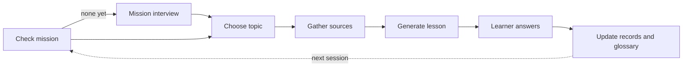
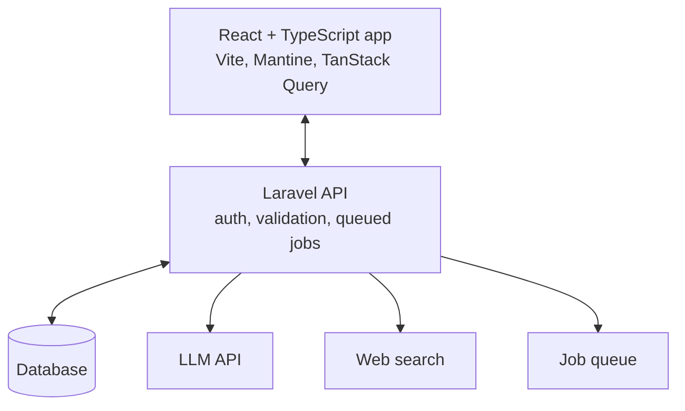
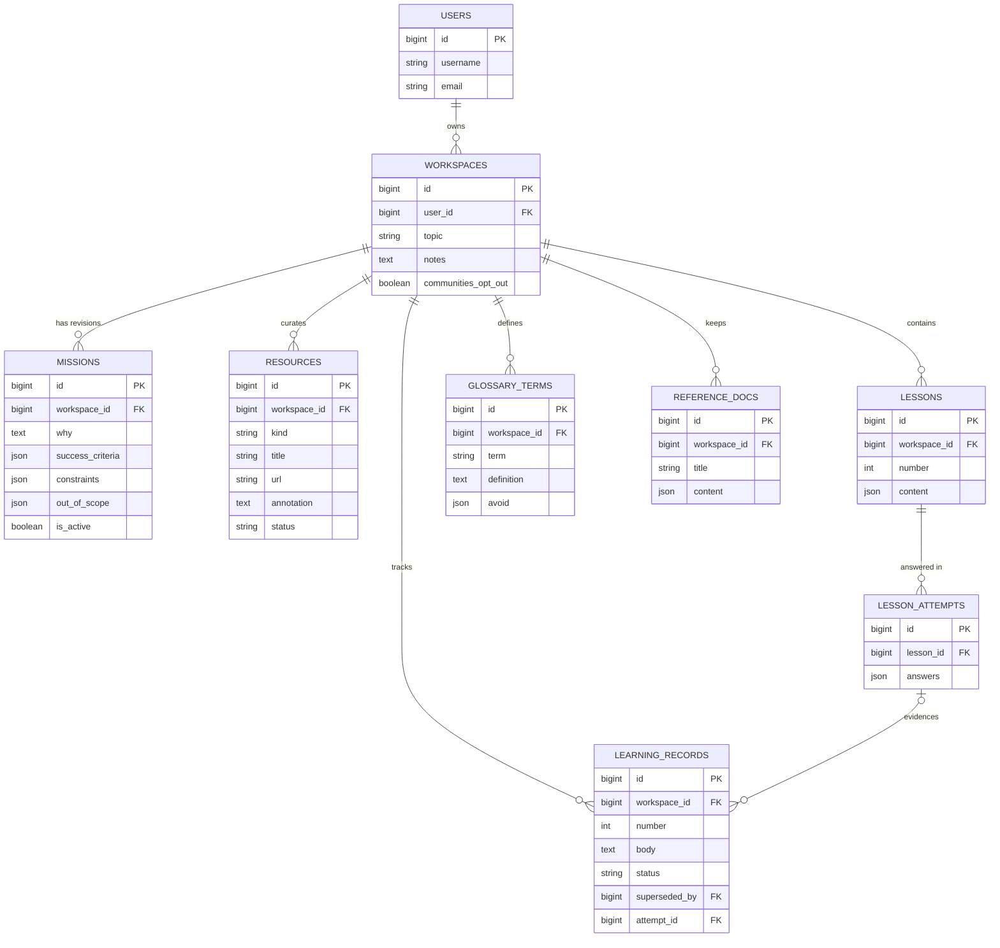

# AI tutor backend onboarding — frontend's view

Status: draft. Everything here is a proposal unless it says decided.

**Scope of this document.** This is the frontend's view of what the backend guarantees
us. It is not the backend's onboarding. The backend developer has the full document
this was trimmed from, including the AI-calls table, Laravel validation notes,
queued-job mechanics, and their build order.

Where this document and the schema disagree, the schema wins.

## Read these first

- [`GLOSSARY.md`](../GLOSSARY.md) — every domain term, defined once
- [`docs/lesson-schema.json`](lesson-schema.json) — **the contract**
- [`docs/lesson-format.md`](lesson-format.md) — prose explaining the format and why
- [`docs/spec.md`](spec.md) — the product spec
- [`docs/AI-TUTOR-FRONTEND-ONBOARDING.md`](AI-TUTOR-FRONTEND-ONBOARDING.md) — our own
  onboarding
- [`docs/adr/`](adr/) — decisions that constrain the implementation

## Where the idea comes from

Matt Pocock's `teach` skill for coding agents: https://github.com/mattpocock/skills/tree/main/skills/productivity/teach

The skill runs a tutoring workflow inside a folder of files. We turn that folder into a
multi-user app.

## The learning loop



Each step is a backend operation with its own validation. The frontend renders results
and submits answers.

## Architecture



- The frontend never calls the model. Every AI call goes through the API.
- Lesson generation takes seconds to minutes. It runs as a queued job, the endpoint
  returns 202, and the frontend polls the lesson list until the lesson appears. No
  streaming.

## Data model



Three notes on the shape:

- Every table hangs off a workspace. Authorize through workspace ownership in one
  policy, not per table.
- **Users are keyed by `username` and `email`.** There is no `name` column, matching
  the implemented auth.
- **`RESOURCES` carries a `title`.** The hydrated response returns one and a citation
  without a title is unusable in the lesson renderer.
- **`LESSONS` has no `primary_source_url`.** The primary source is resolved through
  `primarySource.resourceId` in the lesson JSON, which is what the validator rule and
  the pruning story both need.
- **`LESSON_ATTEMPTS` has no `score` column.** The contract carries no aggregate; the
  frontend computes any summary from `perAnswer`.
- Missions are revisions. Exactly one is active per workspace.
- Learning record numbers increment per workspace. Superseded records stay in the
  table.
- Lesson content is a JSON column, validated before it is saved, carrying
  `schemaVersion`.
- Resources are soft-pruned with `status`. Old lessons cite them, so a hard delete
  would break those citations.

Note the vocabulary: the domain calls these **Sources**, per `GLOSSARY.md`. The table is
named `resources` and the wire format keeps `resourceId`, which is a deliberate split.

## What the backend guarantees the frontend

These are the rules the renderer relies on. If one of them stops holding, say so.

**Mission**

- If a workspace has no active mission, no lesson can be generated. The mission
  interview runs first.
- A mission change needs explicit learner confirmation and creates a learning record.
- Exactly one mission per workspace.

**Resources**

- Every resource needs an annotation. Entries without one are rejected.
- Resources are soft-pruned with `status`, so a citation in an old lesson still
  resolves.
- Gaps are tracked explicitly when no good source exists for something the mission
  needs.

**Lessons**

- A lesson is validated against
  [`docs/lesson-format.md`](lesson-format.md#validation-rules) before it is stored. A
  lesson that fails is rejected and regenerated.
- Knowledge claims come from workspace resources, never the model's own memory. Every
  citation points to a resource in the same workspace.
- One skill per lesson, at most 15 minutes, at least one `quiz`, `recall`, or `steps`
  block.
- Quiz options have the same word count and the correct option exists. Nothing in the
  formatting hints at the answer.
- The lesson response **strips `modelAnswer` and `rubric` from recall blocks.** They
  return in the attempt result.
- Lesson content is stored as it was validated. The frontend can rely on the schema.

**Learning records**

- A record is written only when the learner shows non-trivial understanding, discloses
  prior knowledge, has a misconception corrected, or changes the mission.
- Material that was merely covered does not qualify. Neither does a session log.
- A record needs evidence, such as a quiz answer or a recall response.
- Contradicted records are marked superseded, never deleted.

**Glossary**

- A term is added only after the learner uses it correctly.
- Each term has one preferred word and a list of aliases to avoid.
- Once a glossary exists, every lesson uses its terms.

**Sanitization** — see [ADR-0001](adr/0001-render-untrusted-model-output.md)

- Inline SVG in a `figure` block is sanitized with `enshrined/svg-sanitize`
  `>=0.22.0` before storage. The frontend sanitizes again with DOMPurify.
- Web search results are untrusted. Page text goes to the model as data only and can
  never trigger tools or change missions, records, or the glossary.
- The library has five known bypasses in its history, so the version floor is a floor
  and worth watching for advisories. The second frontend layer is deliberate.

## API

All paths carry the `/api` prefix.

```
GET    /api/workspaces                       the learner's own workspaces
POST   /api/workspaces
GET    /api/workspaces/{id}
PATCH  /api/workspaces/{id}                  teaching notes, community opt-out
DELETE /api/workspaces/{id}

POST   /api/workspaces/{id}/mission-interview/messages
GET    /api/workspaces/{id}/mission
PUT    /api/workspaces/{id}/mission          needs confirmed: true

GET    /api/workspaces/{id}/resources
POST   /api/workspaces/{id}/resources        learner-supplied url + annotation
POST   /api/workspaces/{id}/resources/search queued, returns 202
PATCH  /api/resources/{id}                   includes pruning

POST   /api/workspaces/{id}/lessons/next     queued, returns 202
GET    /api/workspaces/{id}/lessons
GET    /api/lessons/{id}
POST   /api/lessons/{id}/attempts

GET    /api/workspaces/{id}/learning-records
GET    /api/workspaces/{id}/glossary
GET    /api/workspaces/{id}/reference-docs
GET    /api/workspaces/{id}/reviews/due
POST   /api/workspaces/{id}/tutor/messages
```

> **Pending backend agreement.** `PATCH /api/workspaces/{id}`,
> `DELETE /api/workspaces/{id}`, and `POST /api/workspaces/{id}/resources` are **not yet
> agreed.** Stories 19, 21, 55, and 56 in the spec have no endpoint without them. Do
> not build against them until confirmed.

> **Open: how the frontend learns a job finished.** Polling a job status endpoint
> versus polling the lesson list. Needs agreement.

## Contract change protocol

1. Change `docs/lesson-schema.json` in this repository, in a commit.
2. Both sides re-read it. The backend updates its validator and prompt; the frontend
   updates its Zod schema and registry.
3. Bump `schemaVersion` only if old stored lessons would break.

A change that is not in the schema has not happened. If you find the backend doing
something the schema does not describe, that is a bug in one of the two, and the fix is
a schema commit rather than a conversation.

## Risks the frontend shares

- Prompt injection through search results.
- Invented citations. The resource-exists and URL checks catch the obvious cases.
- Grader inflation. A grader that writes a record after every quiz defeats the point.
- Cost and latency.
- Learner answers are personal data. **Retention and deletion are undecided**, which
  blocks story 56 end to end.
